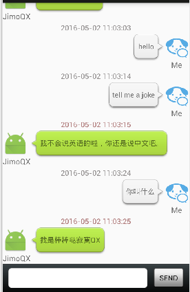

# android-project
how long ...
## ChatRoom-Based-on-tulingAPI
基于图灵API的聊天界面练习

## upark
一个基于百度地图的停车APP

## Gobang
an app game called gobang
五子棋游戏

## socket talk
基于socket双向通信的Android程序，服务器和客户端都在一个APP里

## AMVS

